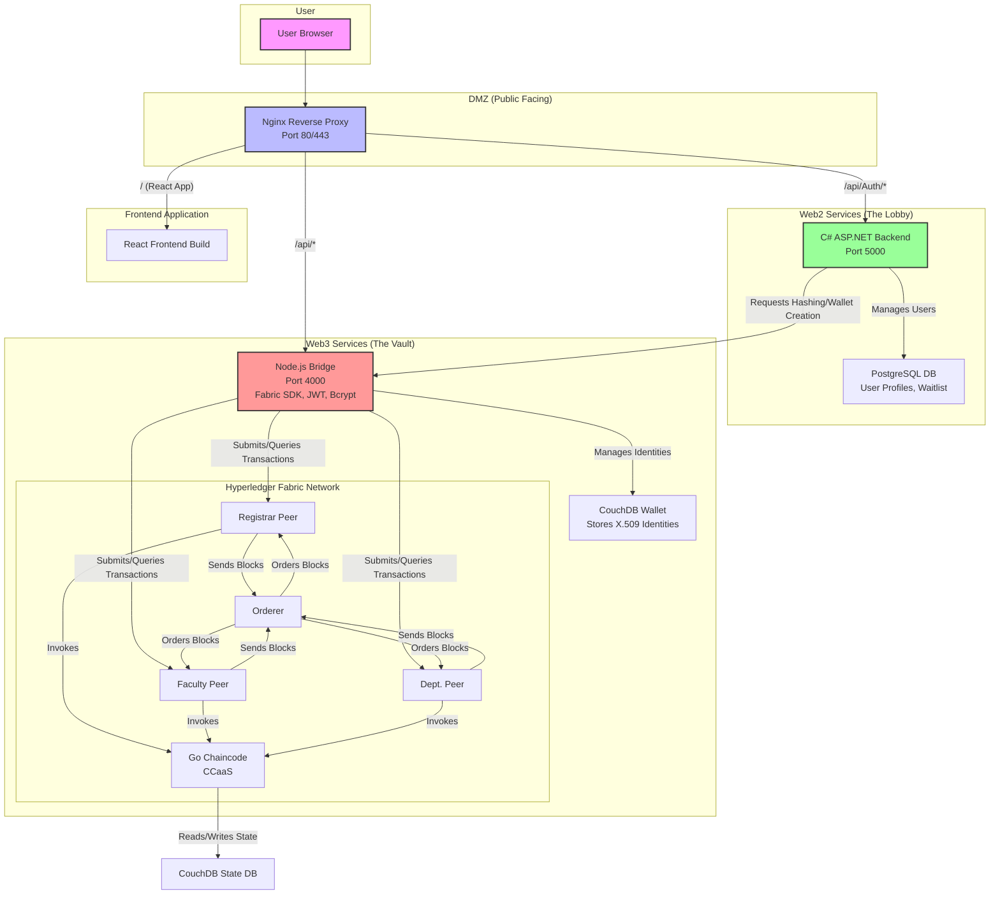
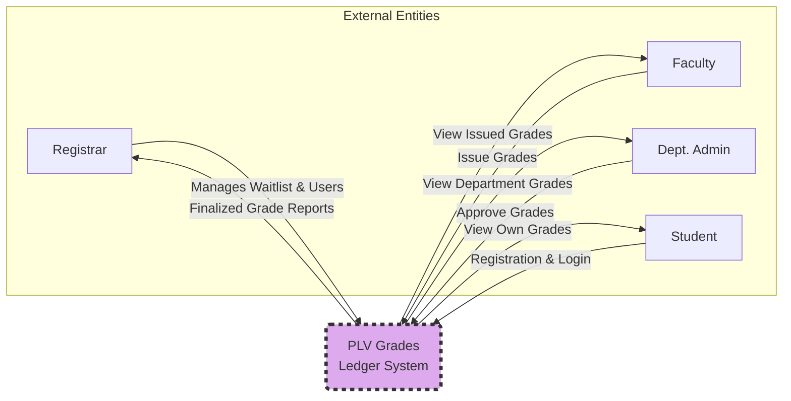
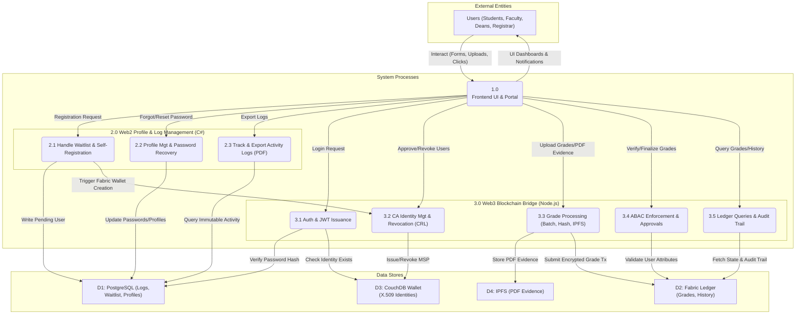
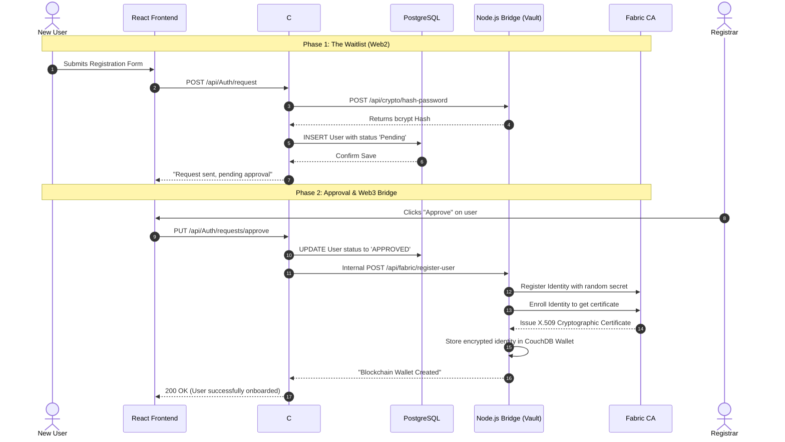
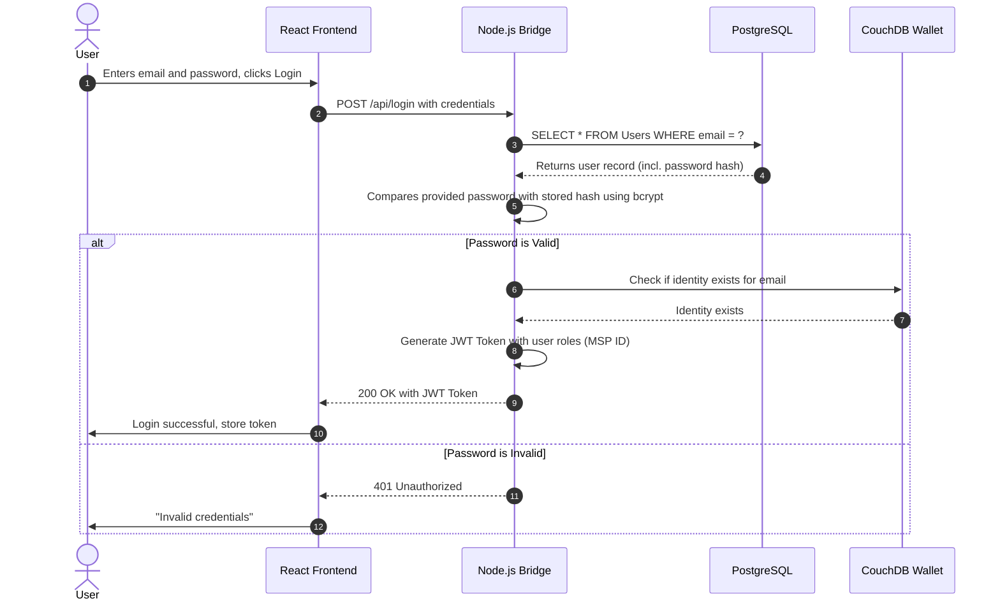
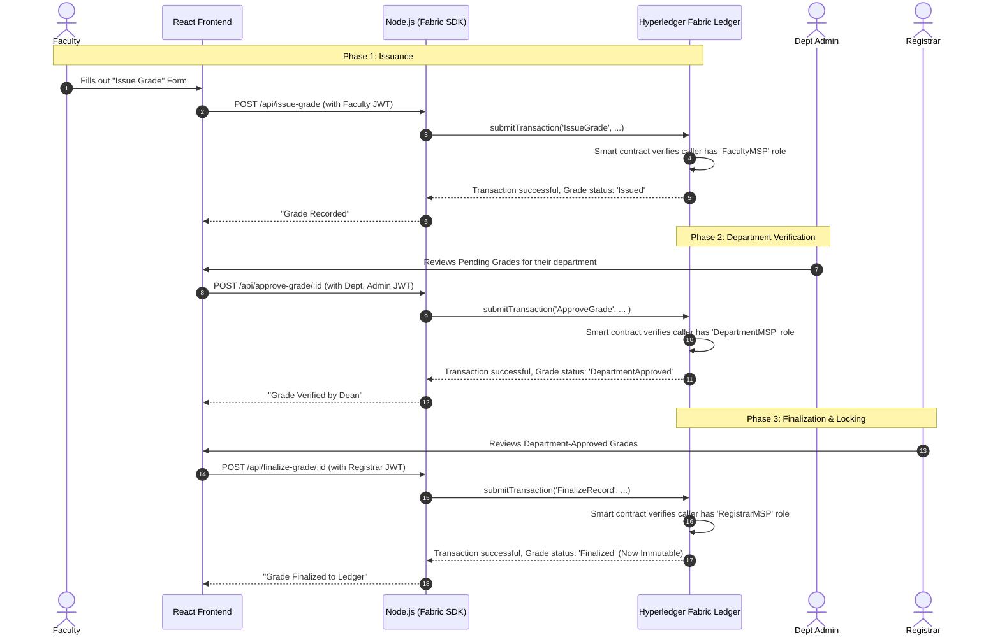

# PLV Grades Ledger: System Architecture & Data Flow Guide

This document provides a comprehensive overview of the system's architecture, data flows, and operational sequences. It is designed to serve as a technical reference and a presentation aid.

## 1. The Core Concept: A Hybrid Web2/Web3 Architecture

To explain the dual-database approach, we use the **"Bank Lobby vs. The Bank Vault"** analogy.

> "Our system operates like a highly secure, modern bank.
>
> The **Web2 services (C# & PostgreSQL)** act as the **Bank Lobby**. This is where we handle high-volume, everyday operations. It's fast, efficient, and flexible. We use it for managing user profiles, handling registration waitlists, and assigning roles—tasks that require frequent updates or potential deletion to comply with data privacy laws. Just like a bank lobby, it's the public-facing and operational hub.
>
> The **Web3 services (Node.js & Hyperledger Fabric)** function as the **Bank Vault**. The vault is not for everyday transactions; it's for securing the most critical, high-value assets that must never be altered. In our system, these assets are the finalized student grades. Once a grade is placed in the blockchain vault, it is cryptographically sealed, decentralized, and permanent, providing an immutable and auditable record for all time."

---

## 2. High-Level System Architecture

The system is a collection of microservices that work in concert, each with a specific responsibility, ensuring a clean separation of concerns.

---

## 3. Data Flow Diagrams (DFD)

### DFD Level 0 (Context Diagram)

This diagram shows the entire system as a single process and its interactions with external user roles, arranged for clarity.
 

### DFD Level 1

This diagram decomposes the system into its core functional processes, illustrating how data flows to fulfill all functional requirements (e.g., ABAC enforcement, IPFS evidence storage, multi-tier grade verification, and immutable audit trails).

---

## 4. Sequence Diagrams

### User Registration & Onboarding
This sequence shows how a user moves from the "Web2 Waitlist" to getting a "Web3 Blockchain Identity".

### User Login
This sequence shows how a user authenticates and receives a JWT token for accessing the system.

### The Grade Lifecycle
This diagram shows the strict, role-based approval flow for grades, from issuance to permanent finalization on the ledger.

