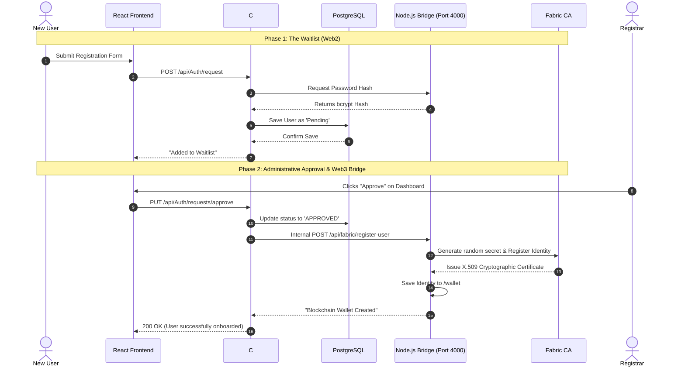
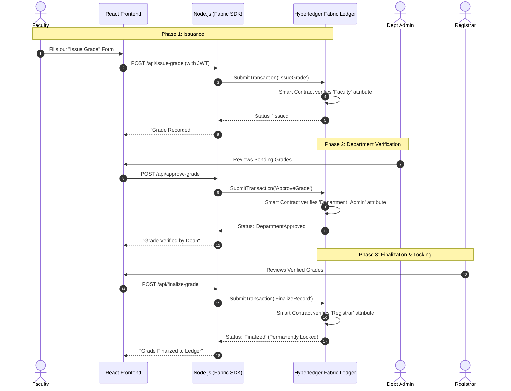

# Guide: System Architecture & Flows

This document is designed to help you explain the **Hybrid Web2/Web3 Architecture** to your thesis panel clearly and professionally.

## 1. The Core Concept: "The Bank Lobby vs. The Bank Vault"
*Use this analogy during your presentation to explain WHY you used both PostgreSQL and Hyperledger Fabric.*

> "Our system operates like a highly secure bank.
> 
> The **Web2 Database (C# & PostgreSQL)** is the **Bank Lobby**. It is fast, efficient, and handles everyday tasks like checking IDs, managing the waitlist, and organizing people into departments. We keep it here to comply with the Data Privacy Act, as blockchains are permanent and cannot easily delete user data.
> 
> The **Web3 Blockchain (Node.js & Hyperledger Fabric)** is the **Bank Vault**. It is heavily guarded, decentralized, and permanent. We don't put everyday passwords or pending requests in the vault; we only put the most critical, finalized assets there—which, in our case, are the students' academic grades."

---

## 2. Sequence Diagram: Registration & Identity Bridge
This diagram shows how a user moves from the "Web2 Waitlist" to getting a "Web3 Blockchain Identity".

---

## 3. Sequence Diagram: The Grade Lifecycle
This diagram shows the strict Attribute-Based Access Control (ABAC) and the decentralized approval flow for grades.

REDIS is Free for local Development but in production and deployment it will require a paid subscription.
REDIS is for memory caching.